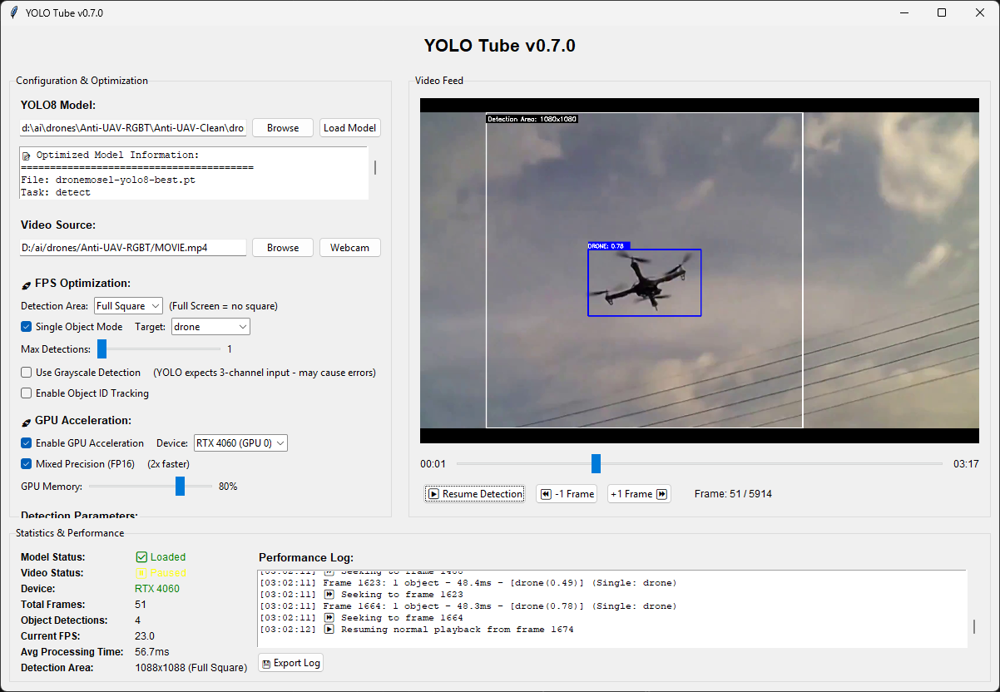

# YOLO Tube v0.7.0

A GUI application for testing YOLO models on video content.

**Note: This project is currently in alpha stage.**



## ⚠️ Disclaimer
 
I'm not a professional developer - this is a learning project. This app is designed to simplify YOLO model testing for beginners and make it easier to get started with YOLO. It's primarily built for my own performance testing and learning purposes. Use at your own discretion!

## Features

- Test YOLO models on video files or webcam
- GPU acceleration (CUDA support)
- Flexible detection areas (full screen, square, custom sizes)
- Object tracking with unique IDs
- Interactive video controls

## Supported Models

- YOLOv8 models (.pt files)
- Tested on YOLOv8 models


## Requirements

- Python 3.7+
- ultralytics
- torch (for CUDA support)
- opencv-python

## Installation

1. Clone the repository:
```bash
git clone https://github.com/Sharyf/YOLO-Tube.git
cd YOLO-Tube
```

2. Install dependencies:
```bash
pip install ultralytics torch opencv-python
```

3. Run the application:
```bash
python test_model_avi_optimized.py
```

## 🎮 Usage

1. **Load Model**: Select your YOLO model file (.pt)
2. **Select Video Source**: Choose video file or webcam (0)
3. **Configure Settings**:
   - Detection area size
   - Confidence threshold
   - IoU threshold
   - GPU acceleration
4. **Start Detection**: Click "Start Detection & Video"
5. **Interactive Controls**:
   - Click video area to pause/resume
   - Use progress bar to seek
   - Frame navigation buttons

## ⚙️ Configuration Options

### Detection Area Modes
- **Full Square**: Largest square that fits in frame
- **Full Screen**: Process entire frame (non-square)
- **Custom Sizes**: 416, 512, 640, 832, 1024 pixels

### Optimization Features
- **GPU Acceleration**: CUDA support for faster inference
- **Mixed Precision**: FP16 for 2x speed improvement
- **Single Object Mode**: Focus on specific object classes
- **Max Detections**: Limit detections per frame for speed
- **Object Tracking**: Assign unique IDs to tracked objects


## 🛠️ Development

This is an alpha release (v0.7.0) actively under development.

### Recent Changes
- ✅ Removed emoji display issues
- ✅ Added proper versioning
- ✅ Fixed detection area boundary issues
- ✅ Added full screen detection mode

### Planned Features
- [ ] Support for more model formats
- [ ] Batch processing capabilities
- [ ] Advanced tracking algorithms
- [ ] Model comparison tools

## 📁 Project Structure

```
YOLO-Tube/
├── test_model_avi_optimized.py  # Main application
├── .gitignore                   # Git ignore rules
├── README.md                    # This file
└── dronemosel-yolo8-best.pt     # Example model (not in repo)
```

## 🤝 Contributing

Contributions are welcome! Please feel free to submit issues and pull requests.

## 📄 License

This project is open source. Please check the license file for details.

## 🐛 Known Issues

- Grayscale detection mode may cause errors (experimental)
- Some GPU memory settings may need adjustment for different hardware

## 📞 Support

If you encounter any issues or have questions, please open an issue on GitHub.

---

**YOLO Tube v0.7.0 Alpha** - Made for testing and optimizing computer vision models
